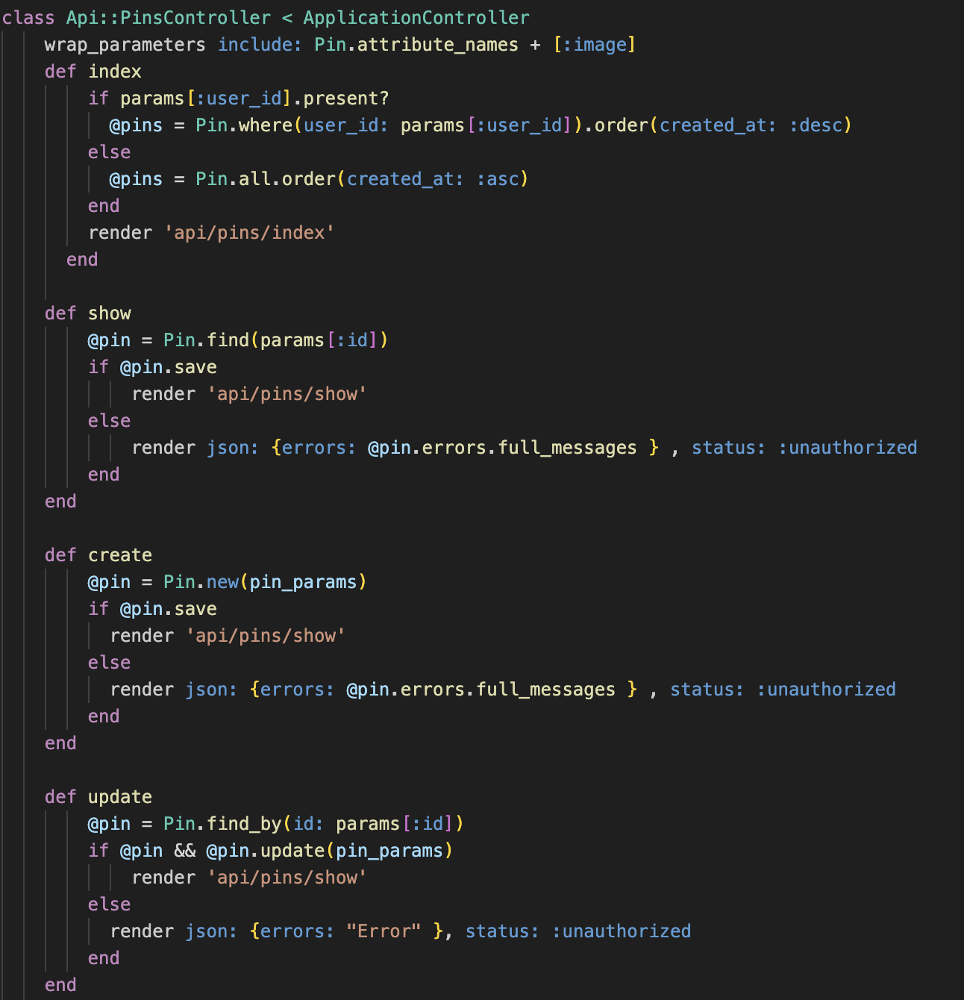
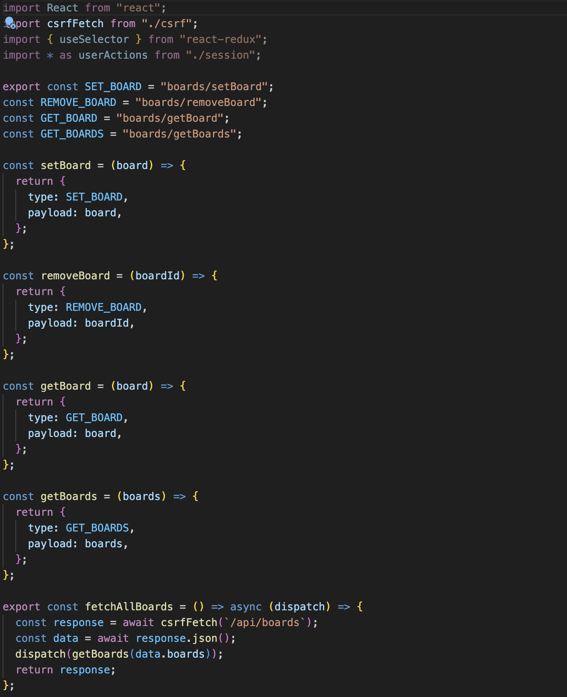
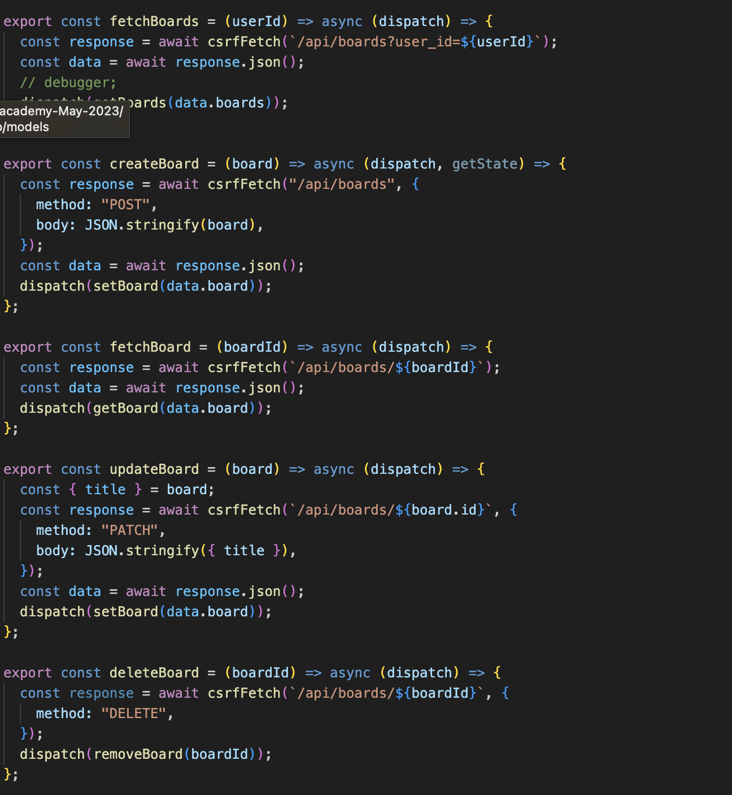
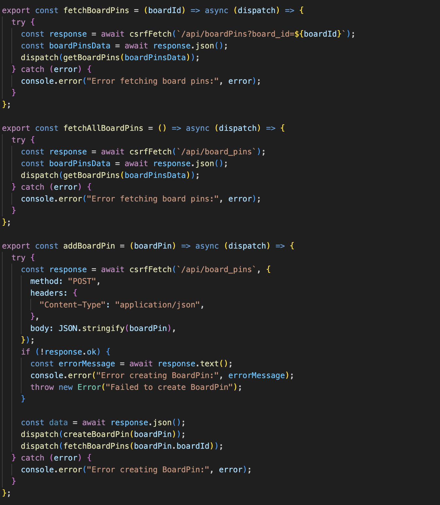
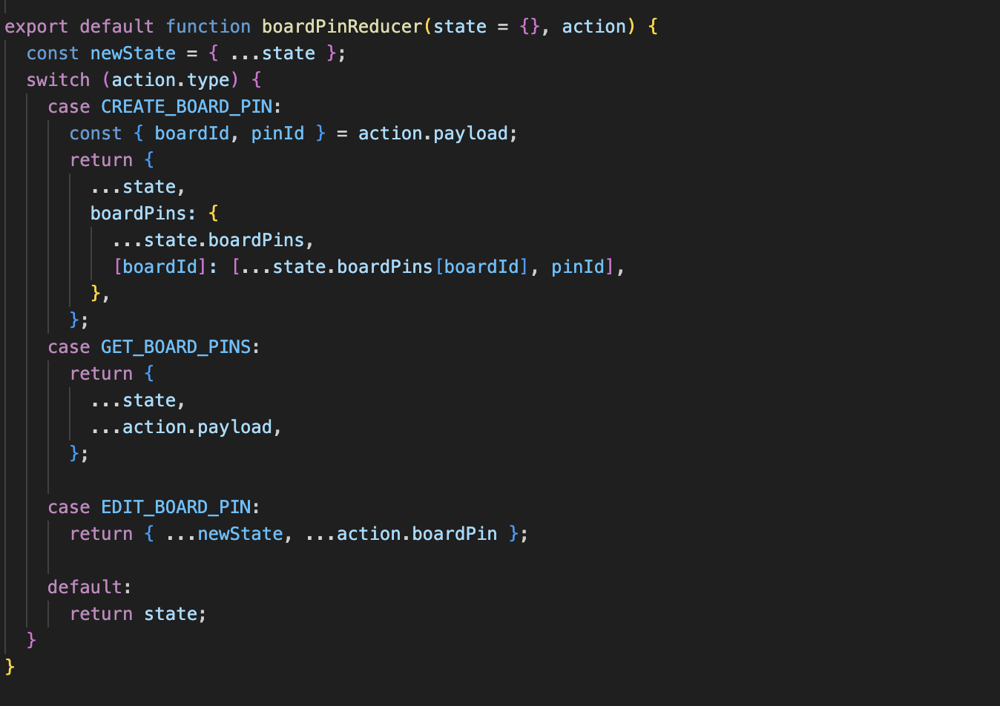

<h1>Overview</h1>

<a href="https://pinspiration.onrender.com/">PinSpiration</a> is a <a href="https://www.pinterest.com/"> Pinterest </a>clone  the social website for sharing and categorizing images.

<h1> Technologies</h1>
<ul>
    <li>Ruby</li>
    <li>Ruby on Rails</li>
    <li>PostgreSQL</li>
    <li>JavaScript</li>
    <li>React</li>
    <li>Redux</li>
    <li>AWS S3</li>
    <li>OnRender</li>
</ul>

<h1> Preview</h1>
<h3>Splash Page</h3>

<h3>Index Page</h3>

<h3>User Profile</h3>

<h3>Create Pin</h3>

<h1>Code snipets</h1>
<h3>Bellow is a code snippet for Pin controller to create, show, update and delete.</h3>

<h3>Bellow is a code snippet for Board Reducer in the frontend with react.</h3>

<h3>Bellow is a code snipper for BoardPin in the frontend.</h3>

<h1>Future Features</h1>
<ul>
    <li>Follows</li>
    <li>Notifications</li>
</ul>

<h1>Credits</h1>
<ul><li>Pinterest</li></ul>
